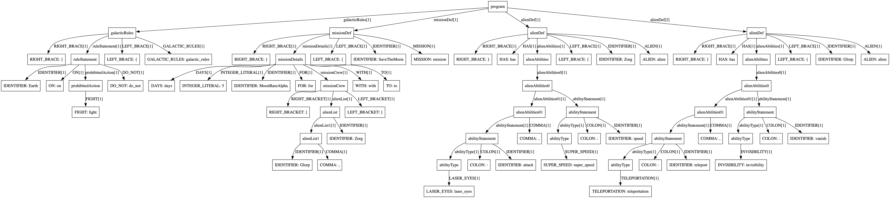

## Parser

A lightweight, extensible, and handcrafted parser designed for flexibility and fun. Built as part of a larger project, I wanted to show this first!
Currently in the debugging case, so if you notice any bugs, please let me know! 

## Features

- **Extensible Grammar**: Add new rules and tokens dynamically.
- **Modular Design**: Easy to tweak and extend.
- **Efficient**: Uses a stack-based approach for smooth parsing.
- **Dynamic Rule Handling**: Define and apply rules on the fly.
- **Parse Tree Generation**: Outputs a clean Parse tree.

## How It Works

1. **Lexer**: Tokenizes your input.
2. **Parser**: Matches tokens against defined rules using a stack.
3. **Dynamic Rules**: Handles subexpressions and new grammar rules.
4. **Output**: Produces a Parse tree that you can take and make into an AST.

If you want to make any changes, check out the grammar folder and lexer folder; there, you can define custom grammars and tokens!
## Quick Start

### Clone and Build

```bash
git clone https://github.com/LiyuZer/Parser.git
cd Parser
make
```

### Run

```bash
./parser++ file_name -i <file for parse graph>
```

### Customize Rules

Edit the `rules` map in the source code to add or modify grammar rules.
Check out the 

## Why This Parser?

- Built entirely from scratch.
- Highly adaptable for custom DSLs or scripting languages, and in the future, hopefully all languages(even context-sensitive ones)
- The format is easy to work with for beginners

## Example of a Good Input based on the set Grammar
```
alien Zorg has {
    speed: super_speed,
    attack: laser_eyes
}

alien Glorp has {
    vanish: invisibility,
    teleport: teleportation
}

mission SaveTheMoon {
    to MoonBaseAlpha
    with [Zorg, Glorp]
    for 5 days
}

galactic_rules {
    do_not fight on Earth
}
```

Grammar is defined here as an unordered map(you can define your own!)
```

    {"program", {
        CreateRule("alienDef"),
        CreateSpecialSymbol('+'),
        CreateRule("missionDef"),
        CreateSpecialSymbol('+'),
        CreateRule("galacticRules"),
        CreateSpecialSymbol('?'),
    }},
    {"alienDef", {
        CreateToken("ALIEN"), // Keyword for defining aliens
        CreateToken("IDENTIFIER"), // Alien's name
        CreateToken("HAS"),
        CreateToken("LEFT_BRACE"),
        CreateRule("alienAbilities"),
        CreateToken("RIGHT_BRACE"),
    }},
    {"alienAbilities", {
        CreateParen('('),
        CreateRule("abilityStatement"),
        CreateParen('('),
        CreateToken("COMMA"),
        CreateRule("abilityStatement"),
        CreateParen(')'),
        CreateSpecialSymbol('?'),
        CreateParen(')'),
        CreateSpecialSymbol('*'), // Allow multiple abilities

    }},
    {"abilityStatement", {
        CreateToken("IDENTIFIER"), // Ability name
        CreateToken("COLON"),
        CreateRule("abilityType"),
    }},
    {"abilityType", {
        CreateToken("SUPER_SPEED"),
        CreateOr(),
        CreateToken("INVISIBILITY"),
        CreateOr(),
        CreateToken("LASER_EYES"),
        CreateOr(),
        CreateToken("TELEPORTATION"),
    }},
    {"missionDef", {
        CreateToken("MISSION"), // Keyword for defining missions
        CreateToken("IDENTIFIER"), // Mission name
        CreateToken("LEFT_BRACE"),
        CreateRule("missionDetails"),
        CreateToken("RIGHT_BRACE"),
    }},
    {"missionDetails", {
        CreateToken("TO"),
        CreateToken("IDENTIFIER"), // Destination
        CreateToken("WITH"),
        CreateRule("missionCrew"),
        CreateToken("FOR"),
        CreateToken("INTEGER_LITERAL"), // Time duration
        CreateToken("DAYS"),
    }},
    {"missionCrew", {
        CreateToken("LEFT_BRACKET"),
        CreateRule("alienList"),
        CreateToken("RIGHT_BRACKET"),
    }},
    {"alienList", {
        CreateToken("IDENTIFIER"), // Alien name
        CreateParen('('),
        CreateToken("COMMA"),
        CreateToken("IDENTIFIER"),
        CreateParen(')'),
        CreateSpecialSymbol('*'),
    }},
    {"galacticRules", {
        CreateToken("GALACTIC_RULES"),
        CreateToken("LEFT_BRACE"),
        CreateRule("ruleStatement"),
        CreateToken("RIGHT_BRACE"),
    }},
    {"ruleStatement", {
        CreateToken("DO_NOT"),
        CreateRule("prohibitedAction"),
        CreateToken("ON"),
        CreateToken("IDENTIFIER"), // Planet name
    }},
    {"prohibitedAction", {
        CreateToken("FIGHT"),
        CreateOr(),
        CreateToken("STEAL"),
        CreateOr(),
        CreateToken("DISRESPECT_EARTHLINGS"),
    }},


```
You can change the grammar as you wish and add any tokens that please you!
## Contact

- **Email**: liyulg0@gmail.com

Let’s make parsing simple and fun!

This is an image of a parser tree(from one of the files in this repo) 


